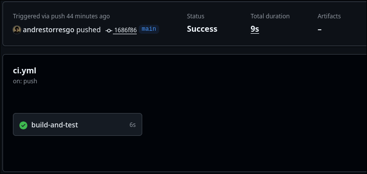
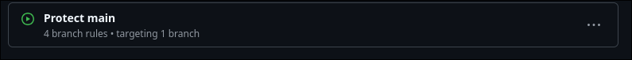
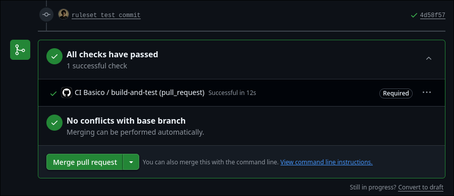

# Ejecución del flujo de trabajo

1. **Creación del repositorio en GitHub**: Se creó un nuevo repositorio llamado `github-actions-ci-demo`.

2. **Configuración de GitHub Actions**:

   - Se creó un flujo de trabajo llamado `CI Basico`.
   - Se configuraron las siguientes acciones:
     - `checkout@v6`: Para obtener el código.
     - `oven-sh/setup-bun@v2`: Para configurar Bun.
     - `upload-artifact@v6`: Para subir los resultados de cobertura.

3. **Ejecución del flujo de trabajo**:
   - Se realizaron varios `push` para verificar que el flujo de trabajo se ejecute correctamente.
   - Se verificó que las pruebas y el linting se ejecuten correctamente.
   - Se verificó que la cobertura se calcule correctamente.

# Código

Se utilizó el framework Hono para crear una API REST para usuarios. Se utiliza Bun como gestor de paquetes y runtime.

El linter para el proyecto es Biome. Instalado con reglas de ultracite.
```bash
npx ultracite@latest init --linter biome
```
Se configuró un comando `check` en el archivo `package.json` para ejecutar el linter.
```json
"scripts": {
  "check": "bun biome check"
}
```

Se eligió Vitest como framework de pruebas unitarias. Y V8 Coverage como herramienta de cobertura.
```bash
bun add -D vitest @vitest/coverage-v8
```

Se configuró un comando `test` en el archivo `package.json` para ejecutar las pruebas unitarias y la cobertura.
```json
"scripts": {
  "test": "vitest run",
  "test:coverage": "vitest run --coverage"
}
```

El archivo `src/index.ts` contiene la aplicación Hono con un endpoint `/health` y un subconjunto de la API REST.

El archivo `src/users.ts` contiene la implementación de la API REST para los usuarios, con endpoints para:

- Obtener todos los usuarios (`GET /users`)
- Obtener un usuario por ID (`GET /users/:id`)
- Crear un usuario (`POST /users`)
- Actualizar un usuario (`PUT /users/:id`)
- Eliminar un usuario (`DELETE /users/:id`)

# Tests

Se configuró un test básico para el endpoint `/health`.
Se configuraron tests para el CRUD de usuarios.

# Resultado

Se realizó un push directamente a main. El flujo de trabajo se ejecutó correctamente y se marcaron los checks como aprobados. Se puede apreciar también la cobertura de código alcanzada.



Se agregó un ruleset en github para protección del branch main. Este ruleset requiere que se ejecute el flujo de trabajo y que se apruebe el pull request para que se pueda hacer merge.



Se realizó un Pull Request apuntando a main y el flujo de trabajo se ejecutó correctamente. La opción de merge se encontraba deshabilitada hasta el momento en el que los checks se marcaron como aprobados.


