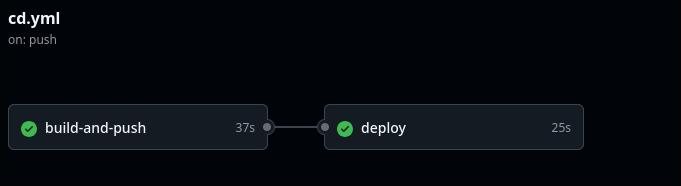
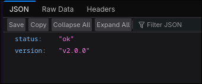
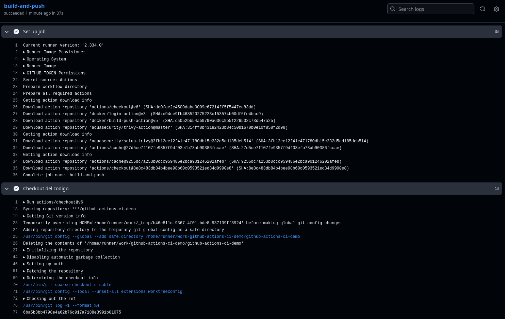
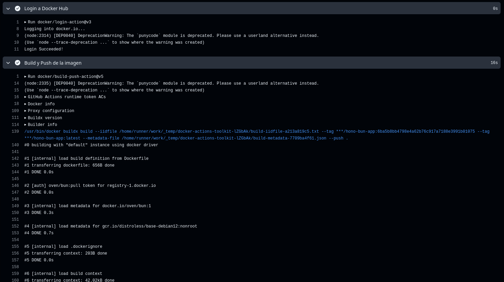
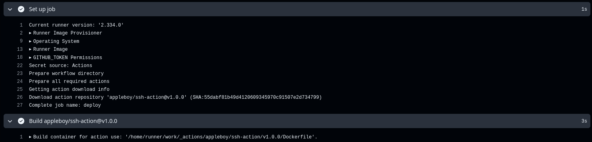
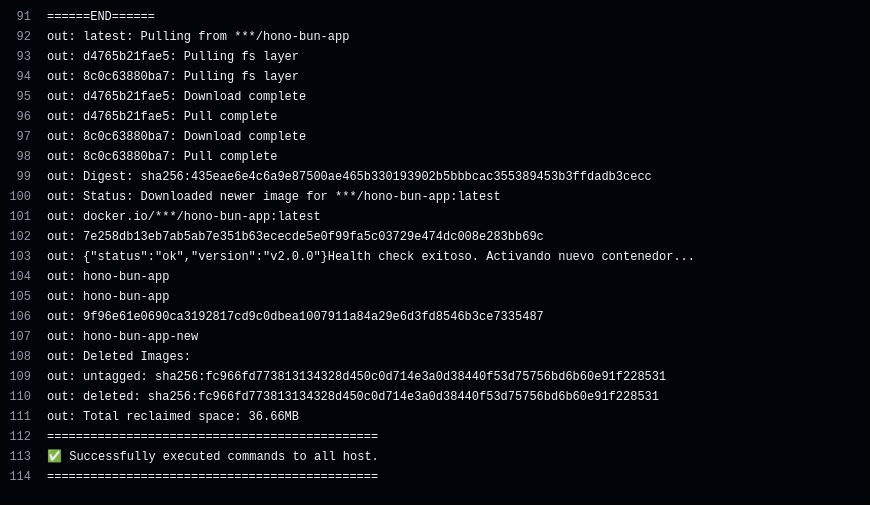
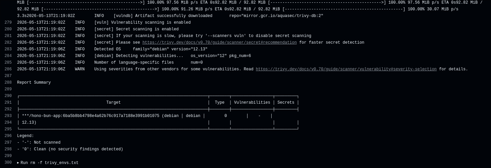

# Ejecución del flujo de trabajo

1. **Creación del repositorio en GitHub**: Se creó un nuevo repositorio llamado `github-actions-ci-demo`.

2. **Configuración de GitHub Actions**:

   - Se creó un flujo de trabajo llamado `CD - Build, Push and Deploy`.
   - Se configuraron las siguientes acciones:
     - `docker/login-action@v3`: Para iniciar sesión en Docker Hub.
     - `docker/build-push-action@v5`: Para construir y subir la imagen a Docker Hub.
     - `appleboy/ssh-action@v1.0.0`: Para desplegar la imagen en el servidor remoto.

3. **Ejecución del flujo de trabajo**:
   - Se realizó un push a main y se verificó que el flujo de trabajo se ejecute correctamente.
   - Se verificó que la imagen se construya y se suba correctamente a Docker Hub.
   - Se verificó que el despliegue se realice correctamente en el servidor remoto.

4. **Secretos**:
   - Se configuraron los siguientes secretos en el repositorio de GitHub:
     - `DOCKER_USERNAME`: Usuario de Docker Hub.
     - `DOCKER_PASSWORD`: Contraseña de Docker Hub.
     - `SSH_HOST`: Dirección IP del servidor remoto.
     - `SSH_USER`: Usuario del servidor remoto.
     - `SSH_PRIVATE_KEY`: Clave SSH del servidor remoto.


# Código

El proyecto consiste en una API REST para usuarios utilizando el framework Hono y Bun como runtime.

El archivo `Dockerfile` define la imagen de Docker para la aplicación. Se utiliza una imagen base de Bun para mantener la imagen pequeña.

```dockerfile
# build stage
FROM oven/bun:1 AS build

WORKDIR /app

# Copy dependencies
COPY bun.lock package.json ./

# Build dependencies
RUN bun install --frozen-lockfile --production --ignore-scripts --verbose

COPY . .

# RUN bun build
RUN bun build --compile --minify --sourcemap ./src --outfile hono-docker-app

# runner stage
FROM gcr.io/distroless/base-debian12:nonroot AS runner

ENV NODE_ENV=production

WORKDIR /app

ARG BUILD_APP_PORT=3000
ENV APP_PORT=${BUILD_APP_PORT}
EXPOSE ${APP_PORT}

# Copy the compiled executable from the build stage
COPY --from=build /app/hono-docker-app .

ENTRYPOINT ["./hono-docker-app"]
```

El archivo `.github/workflows/cd.yml` define el flujo de trabajo de despliegue continuo. Este flujo se ejecuta en cada push a la rama `main` y realiza las siguientes acciones:

1. Inicia sesión en Docker Hub.
2. Construye la imagen de Docker y la etiqueta como `hono-bun-app:latest`.
3. Sube la imagen a Docker Hub.
4. Despliega la imagen en un servidor remoto utilizando SSH.

El flujo de trabajo se define en el archivo `.github/workflows/cd.yml`.

```yaml
name: CD - Build, Push and Deploy

on:
  push:
    branches: [main]

jobs:
  deploy:
    runs-on: ubuntu-latest
    environment: production
    permissions:
      contents: read
      packages: write

    steps:
      - name: Checkout del codigo
        uses: actions/checkout@v6

      - name: Configurar Bun
        uses: oven-sh/setup-bun@v2
        with:
          bun-version: "1.x"

      - name: Instalar dependencias
        run: bun install

      - name: Ejecutar linting
        run: bun run check

      - name: Ejecutar pruebas
        run: bun run test:coverage

      - name: Login a Docker Hub
        uses: docker/login-action@v3
        with:
          username: ${{ secrets.DOCKER_USERNAME }}
          password: ${{ secrets.DOCKER_TOKEN }}

      - name: Build y Push de imagen
        uses: docker/build-push-action@v5
        with:
          context: .
          push: true
          tags: ${{ secrets.DOCKER_USERNAME }}/hono-bun-app:latest
          cache-from: type=gha
          cache-to: type=gha,mode=max

      - name: Despliegue en servidor remoto
        uses: appleboy/ssh-action@v1.0.0
        with:
          host: ${{ secrets.SERVER_IP }}
          username: ${{ secrets.SSH_USERNAME }}
          key: ${{ secrets.SSH_KEY }}
          port: 22
          script: |
            set +e
            IMAGE="${{ secrets.DOCKER_USERNAME }}/hono-bun-app:latest"

            # 1. Desplegar la nueva imagen en un puerto alterno (3001) para validación
            sudo docker pull $IMAGE
            sudo docker run -d \
              --name hono-bun-app-new \
              --restart unless-stopped \
              -p 3001:3000 \
              -e APP_PORT=3000 \
              $IMAGE

            # 2. Validar que la nueva versión esté funcionando
            if curl -s http://localhost:3001/health | grep -q "status": \
               && curl -s http://localhost:3001/users | grep -q "users"; then
              echo "Health check exitoso. Activando nuevo contenedor..."
              
              # 4. Detener y eliminar el contenedor viejo (si existe)
              sudo docker stop hono-bun-app || true
              sudo docker rm hono-bun-app || true
              
              # 5. Exponer el nuevo contenedor en el puerto público 80
              sudo docker run -d \
                --name hono-bun-app \
                --restart unless-stopped \
                -p 80:3000 \
                -e APP_PORT=3000 \
                $IMAGE
              
              # 6. Limpiar el contenedor de validación
              sudo docker rm -f hono-bun-app-new || true
            else
              echo "Health check FALLIDO. Cancelando despliegue y manteniendo versión anterior."
              sudo docker rm -f hono-bun-app-new || true
              exit 1
            fi

            # Limpieza final de imágenes no usadas
            sudo docker system prune -f

El linter para el proyecto es Biome. Instalado con reglas de ultracite.
```bash
npx ultracite@latest init --linter biome
```

Se modificó el archivo `src/index.ts` que contiene el endpoint `/health` y un subconjunto de la API REST.

Ahora health también incluye la version como manera de pruebas.

```typescript
app.get("/health", (c) => {
  return c.json({
    status: "ok",
    version: "2.0.0",
  });
});
```


# Resultado

Se realizó un push a una rama nueva. El flujo de trabajo se ejecutó correctamente y se marcaron los checks como aprobados.



Se ingresó a la IP del servidor y se verificó que la aplicación esté funcionando correctamente. Se puede ver que la versión es la correcta.



# Análisis y Reflexión del Pipeline de CD

## Descripción del pipeline de CD y decisiones técnicas
El pipeline de CD automatiza el proceso de despliegue continuo desde la validación del código hasta su puesta en producción. Está compuesto por varias etapas cruciales:
1. **Validación (CI)**: Checkout del repositorio, instalación de dependencias, análisis de código (linting) y ejecución de pruebas con cobertura. Esto asegura que el nuevo código sea funcional y estable.
2. **Construcción de Imagen Docker**: Se autentica en Docker Hub y se utiliza `docker/build-push-action` para construir la imagen. Se implementa caché (`gha`) para optimizar los tiempos de build, y el Dockerfile utiliza un enfoque *multi-stage* basado en distroless para minimizar el tamaño y superficie de ataque del contenedor.
3. **Escaneo de Vulnerabilidades**: El flujo de despliegue incorpora una etapa de escaneo de la imagen (por ejemplo, utilizando `aquasecurity/trivy-action`) para detectar vulnerabilidades críticas o de severidad alta en las dependencias y el sistema operativo base antes de permitir la actualización en producción.
4. **Despliegue Seguro (Zero-Downtime)**: A través de `appleboy/ssh-action` se realiza la conexión al VPS. Para garantizar la disponibilidad de la aplicación, se descarga la nueva imagen y se levanta en un puerto temporal (3001). A continuación, se valida mediante un health check local. Solo si la validación es exitosa, se procede a reemplazar el contenedor principal (puerto 80) y se elimina el temporal. De lo contrario, la actualización se cancela sin afectar la versión estable anterior.

**Decisiones Técnicas Tomadas:**
- **Uso de GitHub Environments:** Se configuró un entorno (`production`) para gestionar reglas de protección, historial de despliegues y aislar los secretos correspondientes a este ambiente.
- **Validación Post-Despliegue:** Se decidió implementar una verificación activa en un contenedor temporal antes de exponer el tráfico público, mitigando el riesgo de caída (un enfoque simplificado de blue/green deployment).
- **Imágenes Multi-stage y Runtime Distroless:** Decisiones enfocadas en la eficiencia, velocidad de descarga en el servidor y reducción de la superficie de vulnerabilidad.

## Fases del Workflow en Actions








## Evidencia de la aplicación funcionando en instancia remota


## Evidencia del Escaneo de Vulnerabilidades


## Estrategia de Rollback a una versión anterior
Existen diferentes maneras de realizar un rollback en caso de introducir un fallo crítico en producción:
1. **Rollback de Código (Git Revert)**: La estrategia más limpia y natural con CI/CD consiste en hacer un `git revert` del último commit (o commits) con problemas y hacer push a `main`. Esto dispara el workflow nuevamente, empaqueta la versión anterior y la despliega de manera segura con zero-downtime, restaurando la estabilidad de la aplicación manteniendo la trazabilidad en el repositorio.
2. **Rollback Manual en el Servidor**: Si la caída es extremadamente grave y requiere mitigación inmediata sin esperar el tiempo de construcción del pipeline, al usar contenedores se puede ingresar por SSH al VPS, detener el contenedor actual y relanzarlo utilizando un *tag* previo de la imagen de Docker Hub (por ejemplo, el tag que generamos por hash del commit en vez de `latest`). Esto levanta la versión que sabemos que es estable en cuestión de segundos.

## Reflexión: Ventajas de utilizar contenedores y despliegue continuo en un proyecto real
El uso conjunto de contenedores y flujos de despliegue continuo (CD) ofrece beneficios sustanciales en proyectos del mundo real:
- **Consistencia y Fiabilidad**: Los contenedores resuelven el histórico problema de la paridad entre entornos. Lo que funciona y pasa las pruebas en el entorno de CI, se ejecutará idénticamente en el servidor de producción.
- **Agilidad y Velocidad de Entrega**: Al automatizar todo el proceso (tests, build, push y deploy), los equipos de desarrollo reducen drásticamente el tiempo entre escribir el código y entregarlo al usuario final, permitiendo liberar características o correcciones varias veces al día.
- **Reducción de Riesgos (Zero Downtime)**: El despliegue automático estandariza los pasos sin intervención manual. Estrategias como el health check antes del reemplazo de puertos permiten evitar indisponibilidades durante las actualizaciones, ofreciendo una experiencia sin interrupciones para el usuario.
- **Seguridad Integrada (Shift-Left Security)**: Automatizar los análisis estáticos y de vulnerabilidades directamente en el pipeline garantiza un umbral de calidad estricto antes de cada entrega. Además, contar con imágenes inmutables de contenedores prepara la infraestructura para poder escalar ágilmente (por ejemplo, hacia orquestadores como Kubernetes o servicios Cloud Serverless) si la demanda aumenta.
